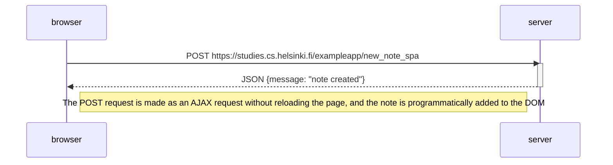

```mermaid
sequenceDiagram
    participant browser
    participant server
    
    browser->>server: POST https://studies.cs.helsinki.fi/exampleapp/new_note_spa
    activate server
    server-->>browser: JSON {message: "note created"}
    deactivate server
    
    Note right of browser: The POST request is made as an AJAX request without reloading the page, and the note is programmatically added to the DOM
```
